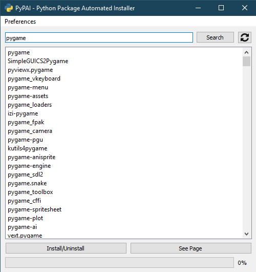

# PyPAI
Python Package Automated Installer - GUI-Based package manager and browser for PyPi

Requires PyQt5, requests, bs4

Self-contained MSWindows EXE is WIP

---

# Screenshots

# Features:
- Search Python packages on PyPi
- Python path and version can be changed
- Results are listed by relevancy
- Install/Uninstall intelligently
- Page View button

# Current Issues
- Slow searching, may take upwards of 30 seconds depending on your wifi and search terms
- Freezes when performing operations
